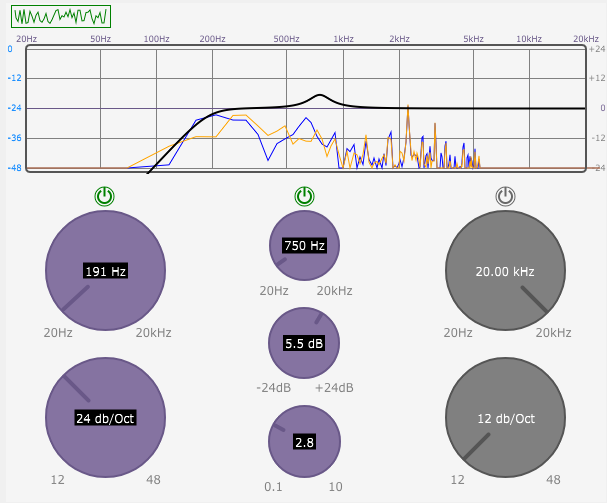

Implementation of a simple parametric EQ with JUCE Framework, following MatkatMusic's tutorial.

Tutorial Link: [MatkatMusic's SimpleEQ Tutorial](https://github.com/matkatmusic/SimpleEQ)

  

To use the VST3 Plugin in your DAW:

1. Download the [SimpleEQ.vst3](https://github.com/inagoy/SimpleEQ/blob/main/SimpleEQ.vst3) file from the repository.
2. Drop the SimpleEQ.vst3 file into your DAW's Plugins VST or VST3 folder. (For example, on Windows, it could be located at `C:\Program Files\VstPlugins` or `C:\Program Files\Common Files\VST3` )
3. Open your DAW and use it like any other plugin.
